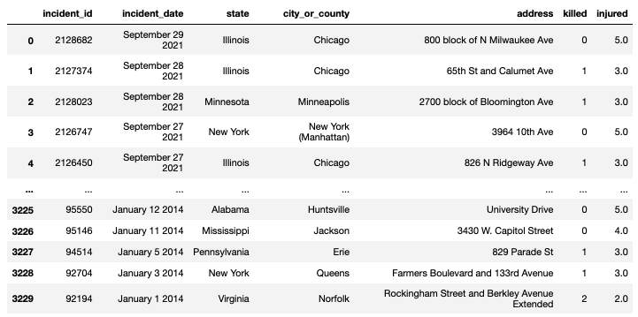
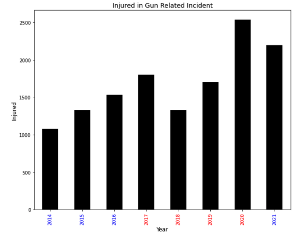
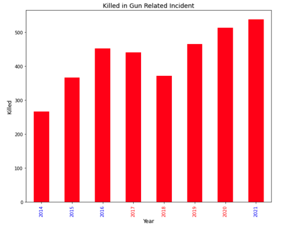
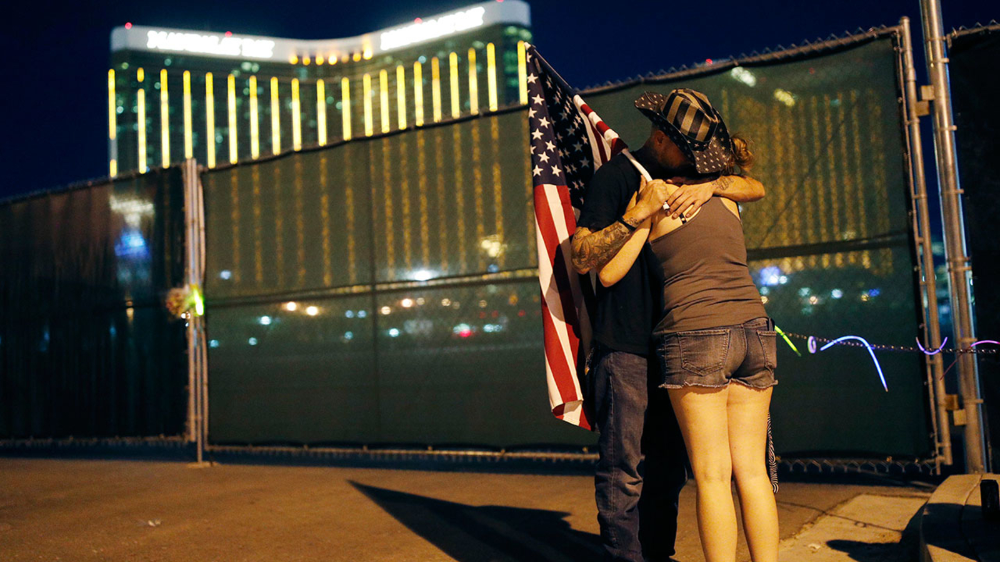
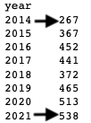

# Gun Related Incidents & Federal/State Policy
#  An Analysis By: James Gamarra <ul><em> Data Set: U.S. Gun Violence Records 2014-2021: Archive of Gun Violence incidents in United States</em></ul> 
<h2>Introduction:</h2>
    <ul>
Gun violence in the United States is a well documented problem that has no clear resolution. My aim through the course of this analysis is to examine an aggregated data set in an attempt to examine correlations, outliers, and any key contributing factors that may cause an influx or deflux in gun related incidents.
    
 
    </ul>

<h3>Data Set: <em>U.S. Gun Violence Records 2014-2021: Archive of Gun Violence incidents in United States</em></h3>
<ul>
    <li>
    Columns(7): incident_id, incident_date, state, city_or_county, address, killed, injured.
    </li>
    <li>
    4 Numerical, 3 Categorical
    </li>
    <li>
    3230 Entries
    </li>
    <li>
    31Dec13 - 28Sep21
    </li>
    <li>
    Data Set is cleaned so there are no Nan’s.
    </li>
    <li>
     Gun violence  and crime incidents are collected/validated from 7,500 sources daily – Incident Reports and their source data are found at the gunviolencearchive.org website. However, this does not ensure a complete data set. 
    </li>
    
</ul>
<h3>Data Set Constraints:</h3>
<li>Aggregated Data
    <ul>
        <li>Data is condensed to 3,230 from over 300,000 entries for purposes of analysis.</li>
    </ul>
</li>
<li>
    States are not required to report all incidents.
</li>
<h2> Part 1:<em> Federal Analysis</em>
</h2>

In terms of the scope of the data, 3230 entries representing 8 years of gun related incidents, it is best to begin analysis on a broader scope and narrow through calculated research.

In the past decade federal policy has been forced to address the impeding crisis that is gun violence in the United States. This talking point, widely debated, has seemingly no remedy in sight. Our data set contains data from the Obama Administration as well as the Trump administration. Two presdencies with vastly diffrent views on gun-policy and gun control in the United States.

At face value, you can deduce two things:
<ul>
1. There is a clear and obvious increase between every year with 17'-18' & 20'-21'as an exception.
</ul>
<ul>
&
</ul>
<ul>
2. The Obama Administration yeilded less Gun Related Injuries than the Trump Administration
</ul>
And the same can be deduced from the "Killed by Gun Related Incident" graph below.

But why? Maybe a more in depth analysis will reveal a correlation.

The consistent outlier between the "Injured" and "Killed" by year graphic is the apparent drop in incidents in 2018.

Looking only at Federal level actions, there were no federal gun laws passed in 2017 that could have spurred a fluctuation. How can we explain this?

October 1st, 2017 the largest mass shooting in modern history left 58 people dead and injured close to 700. Following this incident, while there were no federal gun laws implemented... 

<h4><em>
"... More than 30 laws preventing gun violence passed in state legislatures..." - Newsweek
</h4></em>

This influx of new policies can be attributed as a possible explanation to the decrease in gun related incidences. Besides, this outlier the only correlation that can be derived on a federal level is the 101.4% increase between 2014 and 2021 per the data set. 

