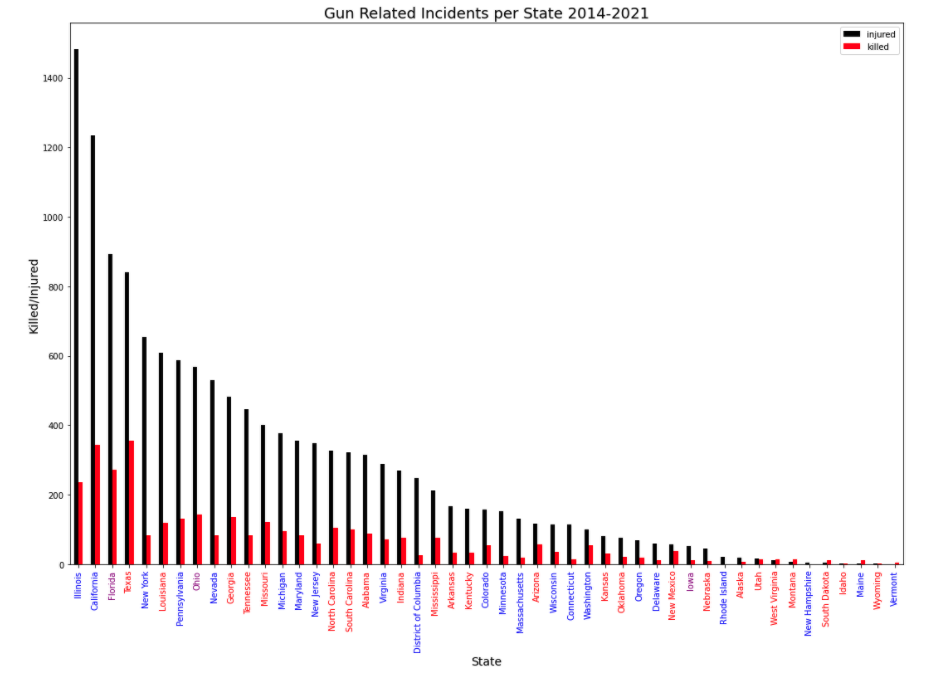

# Gun Related Incidents & Federal/State Policy
#  An Analysis By: James Gamarra <ul><em> Data Set: U.S. Gun Violence Records 2014-2021: Archive of Gun Violence incidents in United States</em></ul> 
<h2>Introduction:</h2>
    <ul>
Gun violence in the United States is a well documented problem that has no clear resolution. My aim through the course of this analysis is to examine an aggregated data set in an attempt to examine correlations, outliers, and any key contributing factors that may cause an influx or deflux in gun related incidents.
    
 
    </ul>

<h3>Data Set: <em>U.S. Gun Violence Records 2014-2021: Archive of Gun Violence incidents in United States</em></h3>
<ul>
    <li>
    Columns(7): incident_id, incident_date, state, city_or_county, address, killed, injured.
    </li>
    <li>
    4 Numerical, 3 Categorical
    </li>
    <li>
    3230 Entries
    </li>
    <li>
    31Dec13 - 28Sep21
    </li>
    <li>
    Data Set is cleaned so there are no Nan’s.
    </li>
    <li>
     Gun violence  and crime incidents are collected/validated from 7,500 sources daily – Incident Reports and their source data are found at the gunviolencearchive.org website. However, this does not ensure a complete data set. 
    </li>
    
</ul>
<h3>Data Set Constraints:</h3>
<li>Aggregated Data
    <ul>
        <li>Data is condensed to 3,230 from over 300,000 entries for purposes of analysis.</li>
    </ul>
</li>
<li>
    States are not required to report all incidents.
</li>
<h2> Part 1:<em> Federal Analysis</em>
</h2>

In terms of the scope of the data, 3230 entries representing 8 years of gun related incidents, it is best to begin analysis on a broader scope and narrow through calculated research.

In the past decade federal policy has been forced to address the impeding crisis that is gun violence in the United States. This talking point, widely debated, has seemingly no remedy in sight. Our data set contains data from the Obama Administration as well as the Trump administration. Two presdencies with vastly diffrent views on gun-policy and gun control in the United States.

At face value, you can deduce two things:
<ul>
1. There is a clear and obvious increase between every year with 17'-18' & 20'-21'as an exception.
</ul>
<ul>
&
</ul>
<ul>
2. The Obama Administration yeilded less Gun Related Injuries than the Trump Administration
</ul>
And the same can be deduced from the "Killed by Gun Related Incident" graph below.

But why? Maybe a more in depth analysis will reveal a correlation.

The consistent outlier between the "Injured" and "Killed" by year graphic is the apparent drop in incidents in 2018.

Looking only at Federal level actions, there were no federal gun laws passed in 2017 that could have spurred a fluctuation. How can we explain this?

October 1st, 2017 the largest mass shooting in modern history left 58 people dead and injured close to 700. Following this incident, while there were no federal gun laws implemented... 

<h4><em>
"... More than 30 laws preventing gun violence passed in state legislatures..." - Newsweek
</h4></em>

This influx of new policies can be attributed as a possible explanation to the decrease in gun related incidences. Besides, this outlier the only correlation that can be derived on a federal level is the <strong>101.4% increase between 2014 and 2021</strong> per the data set. 

It is important to note that during the Obama Administration gun owners rights were actually expanded. However, in response to the 2017, Sandy Hook shooting, a rule was introduced requiring the Social Security Administration to report disability-benefit recipients with mental health conditions to the FBI’s background check system, which is used to screen firearm buyers.

The Trump Administration rescinded this rule in 2017.

<h2> Part 2:<em> State Analysis</em>
</h2>

Building on the federal analysis, in the past decade it can be deduced that the most noteble factors which influenced gun violence appeared on a state level. 

The state analysis section will encompass a data analysis focusing on:
<ul>
1. State political affiliation examining any correlations.
</ul>
<ul>
&
</ul>
<ul>
2. If any state passed gun legislation that had any effects on growing gun related incidents.
</ul> 

It is important to analyze on a state level do to the autonmous nature of state governments. The Texas state government does not behave like Washington state and there and in many ways it is good to analyze state level successes and failures in order to determine best practices for potential federal implementation.

Speaking in terms of gun violence at a state level we can use our data set to visualize which states have the most occurences of Gun Related Killing's and Injuries.

Things to note:
<ul>
- From a broad perspective, over the course of 8 years, Illinois has the most gun related incidents, while Vermont has the least.
</ul>
<ul>
 - Population is not taken into account, while Illinois has the most incidents, the state is over twice(12.58M) as populated as Tennessee(6.21M). Furthermore, California(39.53M) ranks 2nd in gun related Incidents, it is 8.5x more populated than 6th ranking Louisiana(4.65M). Population is a crucial contributor.
</ul>

<h2><em> Conclusion</em></h2>

After analyzing the limited data presented, it can be seen that trends of gun violence in the United States have been fairly consistent with implementation of Federal and State laws passed throughout the country. Mass Shootings tend to trigger spurs of legislative action, however, it is not often passed. Over the last 8 years, there have been little to no federal gun laws passed that have made any impact on the upward trend of gun related incidents. However, in state governments, legislation passed was able to alter the trend but not ultimately eliminate the problem.

<h1><em> References</em></h1>
<li>
https://www.kaggle.com/konivat/us-gun-violence-archive-2014
</li>
<li>
https://www.gunviolencearchive.org/reports
</li>
<li>
https://www.newsweek.com/gun-laws-mass-shootings-2017-donald-trump-751884
</li>

